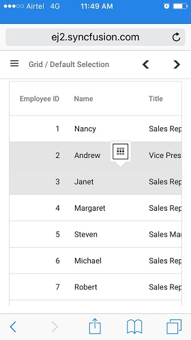

# Selection

Selection provides an option to highlight a row or cell or column.
Selection can be done through simple Mouse down or Arrow keys.
To disable selection in the Grid, set the [`allowSelection`](../../api/grid/#allowselection) to false.

The grid supports two types of selection that can be set by using the
[`selectionSettings.type`](../../api/grid/selectionSettings/#type).They are:

* **Single** - The **Single** value is set by default. Allows you to select only a single row or cell or column.
* **Multiple** - Allows you to select multiple rows or cells or columns.
To perform the multi-selection, press and hold CTRL key and click the desired rows or cells  or columns.
To select range of rows or cells or columns, press and hold the SHIFT key and click the rows or cells or columns.



```typescript
import { Component, OnInit } from '@angular/core';
import { data } from './datasource';
import { SelectionSettingsModel } from '@syncfusion/ej2-angular-grids';

@Component({
    selector: 'app-root',
    template: `<ejs-grid [dataSource]='data' [selectionSettings]='selectionOptions' height='315px'>
                <e-columns>
                    <e-column field='OrderID' headerText='Order ID' textAlign='Right' width=120></e-column>
                    <e-column field='CustomerID' headerText='Customer ID' width=150></e-column>
                    <e-column field='ShipCity' headerText='Ship City' width=150></e-column>
                    <e-column field='ShipName' headerText='Ship Name' width=150></e-column>
                </e-columns>
                </ejs-grid>`
})
export class AppComponent implements OnInit {

    public data: object[];
    public selectionOptions: SelectionSettingsModel;

    ngOnInit(): void {
        this.data = data;
        this.selectionOptions = { type: 'Multiple' };
    }
}

```



## Selection mode

Grid supports three types of selection mode which can be set by using
[`selectionSettings.mode`](../../api/grid/selectionSettings/#mode). They are:

* **Row** - The **row** value is set by default. Allows you to select rows only.
* **Cell** - Allows you to select cells only.
* **Both** - Allows you to select rows and cells at the same time.



```typescript
import { Component, OnInit } from '@angular/core';
import { data } from './datasource';
import { SelectionSettingsModel } from '@syncfusion/ej2-angular-grids';

@Component({
    selector: 'app-root',
    template: `<ejs-grid [dataSource]='data' [selectionSettings]='selectionOptions' height='315px'>
                <e-columns>
                    <e-column field='OrderID' headerText='Order ID' textAlign='Right' width=120></e-column>
                    <e-column field='CustomerID' headerText='Customer ID' width=150></e-column>
                    <e-column field='ShipCity' headerText='Ship City' width=150></e-column>
                    <e-column field='ShipName' headerText='Ship Name' width=150></e-column>
                </e-columns>
                </ejs-grid>`
})
export class AppComponent implements OnInit {

    public data: object[];
    public selectionOptions: SelectionSettingsModel;

    ngOnInit(): void {
        this.data = data;
        this.selectionOptions = { mode: 'Both' };
    }
}

```



## Touch interaction

When you tap Grid row on touch screen devices, then the tapped row is selected.
Also, it will show a popup   for multi-row-selection.
To select multiple rows or cells, tap the popup  and then tap the desired rows or cells.

> For multi-selection, It requires the selection [`type`](../../api/grid/selectionSettings/#type) to be **Multiple**.

The following screenshot represents a Grid touch selection in the device.



## See Also

* [Animate the Grid selected row in Angular Grid](https://www.syncfusion.com/forums/156448/animate-the-grid-selected-row-in-angular-grid)
* [How can I disable the row selection on context menu click in Angular Grid](https://www.syncfusion.com/forums/143449/how-can-i-disable-the-row-selection-on-context-menu-click-in-angular-grid)
* [How to retrieve the selected records in the Grid in Angular Grid](https://www.syncfusion.com/forums/150200/how-to-retrieve-the-selected-records-in-the-grid-in-angular-grid)
* [How to prevent tab to focus on a cell when inside a grid in Angular Grid](https://www.syncfusion.com/forums/156333/how-to-prevent-tab-to-focus-on-a-cell-when-inside-a-grid-in-angular-grid)
* [How to select the first row of the Grid, after the grid refreshed in Angular Grid](https://www.syncfusion.com/forums/152715/how-to-select-the-first-row-of-the-grid-after-the-grid-refreshed-in-angular-grid)
* [How to select the multiple row at initial render in Angular Grid](https://www.syncfusion.com/forums/156142/how-to-select-the-multiple-row-at-initial-render-in-angular-grid)
* [How to cancel the selection of first record while adding a new record in Angular Grid](https://www.syncfusion.com/forums/163325/how-to-cancel-the-selection-of-first-record-while-adding-a-new-record-in-angular-grid)