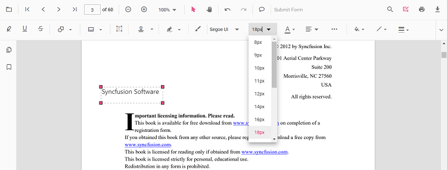

# Free text annotation in Angular Pdfviewer component

The PDF Viewer control provides the options to add, edit, and delete the free text annotations.

## Adding a free text annotation to the PDF document

The Free text annotations can be added to the PDF document using the annotation toolbar.

* Click the **Edit Annotation** button in the PDF Viewer toolbar. A toolbar appears below it.
* Select the **Free Text Annotation** button in the annotation toolbar. It enables the Free Text annotation mode.
* You can add the text over the pages of the PDF document.

In the pan mode, if the free text annotation mode is entered, the PDF Viewer control will switch to text select mode.


Refer to the following code sample to switch to the Free Text annotation mode.

```typescript
import { ViewChild } from '@angular/core';
import { Component, OnInit } from '@angular/core';
import {
  PdfViewerComponent, LinkAnnotationService, BookmarkViewService, MagnificationService, ThumbnailViewService,
  ToolbarService, NavigationService, TextSearchService, TextSelectionService, PrintService, AnnotationService
} from '@syncfusion/ej2-angular-pdfviewer';

@Component({
  selector: 'app-root',
  // Specifies the template string for the PDF Viewer component.
  template: `<button (click)="addAnnot()">FreeText</button>
  <div class="content-wrapper">
  <ejs-pdfviewer id="pdfViewer" [serviceUrl]='service' [documentPath]='document' style="height:640px;display:block"></ejs-pdfviewer>
  </div>`,
  providers: [LinkAnnotationService, BookmarkViewService, MagnificationService, ThumbnailViewService, ToolbarService,
NavigationService, TextSearchService, TextSelectionService, PrintService, AnnotationService]
})
export class AppComponent implements OnInit {
  @ViewChild('pdfviewer')
  public pdfviewerControl: PdfViewerComponent;
  public service: string = 'https://ej2services.syncfusion.com/production/web-services/api/pdfviewer';
  public document: string = 'PDF_Succinctly.pdf';
  addAnnot() {
    var pdfviewer = (<any>document.getElementById("pdfViewer"))
      .ej2_instances[0];
    pdfviewer.annotationModule.setAnnotationMode("FreeText");
  }
  ngOnInit(): void {
  }
}
```

## Editing the properties of free text annotation

The font family, font size, font styles, font color, text alignment, fill color, the border stroke color, border thickness, and opacity of the free text annotation can be edited using the Font Family tool, Font Size tool, Font Color tool, Text Align tool, Font Style tool  Edit Color tool, Edit Stroke Color tool, Edit Thickness tool, and Edit Opacity tool in the annotation toolbar.

### Editing font family

The font family of the annotation can be edited by selecting the desired font in the Font Family tool.


### Editing font size

The font size of the annotation can be edited by selecting the desired size in the Font Size tool.



### Editing font color

The font color of the annotation can be edited using the color palette provided in the Font Color tool.


### Editing the text alignment

The text in the annotation can be aligned by selecting the desired styles in the drop-down pop-up in the Text Align tool.


### Editing text styles

The style of the text in the annotation can be edited by selecting the desired styles in the drop-down pop-up in the Font Style tool.


### Editing fill color

The fill color of the annotation can be edited using the color palette provided in the Edit Color tool.


### Editing stroke color

The stroke color of the annotation can be edited using the color palette provided in the Edit Stroke Color tool.


### Editing thickness

The border thickness of the annotation can be edited using the range slider provided in the Edit Thickness tool.


### Editing opacity

The opacity of the annotation can be edited using the range slider provided in the Edit Opacity tool.


## Setting default properties during control initialization

The properties of the free text annotation can be set before creating the control using the FreeTextSettings.

After editing the default values, they will be changed to the selected values.
Refer to the following code sample to set the default free text annotation settings.

```typescript
import { ViewChild } from '@angular/core';
import { Component, OnInit } from '@angular/core';
import {
  PdfViewerComponent, LinkAnnotationService, BookmarkViewService, MagnificationService, ThumbnailViewService,
  ToolbarService, NavigationService, TextSearchService, TextSelectionService, PrintService, AnnotationService
} from '@syncfusion/ej2-angular-pdfviewer';

@Component({
  selector: 'app-root',
  // Specifies the template string for the PDF Viewer component.
  template: `<div class="content-wrapper">
  <ejs-pdfviewer id="pdfViewer" [serviceUrl]='service' [documentPath]='document' [freeTextSettings]='freeTextSettings' style="height:640px;display:block"></ejs-pdfviewer>
  </div>`,
  providers: [LinkAnnotationService, BookmarkViewService, MagnificationService, ThumbnailViewService, ToolbarService,
NavigationService, TextSearchService, TextSelectionService, PrintService, AnnotationService]
})
export class AppComponent implements OnInit {
  @ViewChild('pdfviewer')
  public pdfviewerControl: PdfViewerComponent;
  public service: string = 'https://ej2services.syncfusion.com/production/web-services/api/pdfviewer';
  public document: string = 'PDF_Succinctly.pdf';
  public freeTextSettings = {fillColor: 'green', borderColor: 'blue', fontColor: 'yellow'};
  ngOnInit(): void {
  }
}
```

You can also enable the autofit support for free text annotation by using the enableAutoFit boolean property in freeTextSettings as below. The width of the free text rectangle box will be increased based on the text added to it.

```typescript
import { ViewChild } from '@angular/core';
import { Component, OnInit } from '@angular/core';
import {
  PdfViewerComponent,
  LinkAnnotationService,
  BookmarkViewService,
  MagnificationService,
  ThumbnailViewService,
  ToolbarService,
  NavigationService,
  TextSearchService,
  TextSelectionService,
  PrintService,
  AnnotationService,
} from '@syncfusion/ej2-angular-pdfviewer';

@Component({
  selector: 'app-root',
  // Specify the template string for the PDF Viewer component.
  template: `<div class="content-wrapper">
  <ejs-pdfviewer id="pdfViewer" [serviceUrl]='service' [documentPath]='document' [freeTextSettings]='freeTextSettings' style="height:640px;display:block"></ejs-pdfviewer>
  </div>`,
  providers: [
    LinkAnnotationService,
    BookmarkViewService,
    MagnificationService,
    ThumbnailViewService,
    ToolbarService,
    NavigationService,
    TextSearchService,
    TextSelectionService,
    PrintService,
    AnnotationService,
  ],
})
export class AppComponent implements OnInit {
  @ViewChild('pdfviewer')
  public pdfviewerControl: PdfViewerComponent;
  public service: string =
    'https://ej2services.syncfusion.com/production/web-services/api/pdfviewer';
  public document: string = 'PDF_Succinctly.pdf';
  public freeTextSettings = { enableAutoFit: true };
  ngOnInit(): void {}
}
```