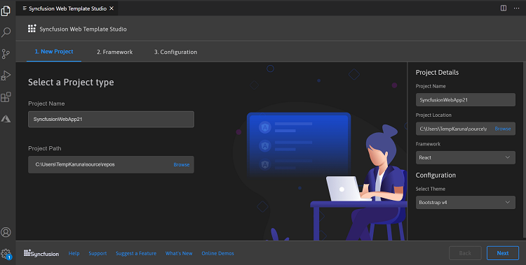
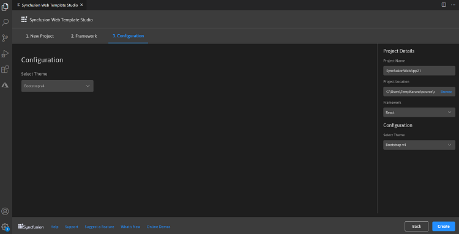
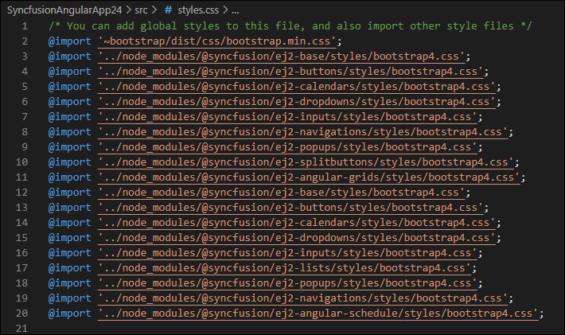
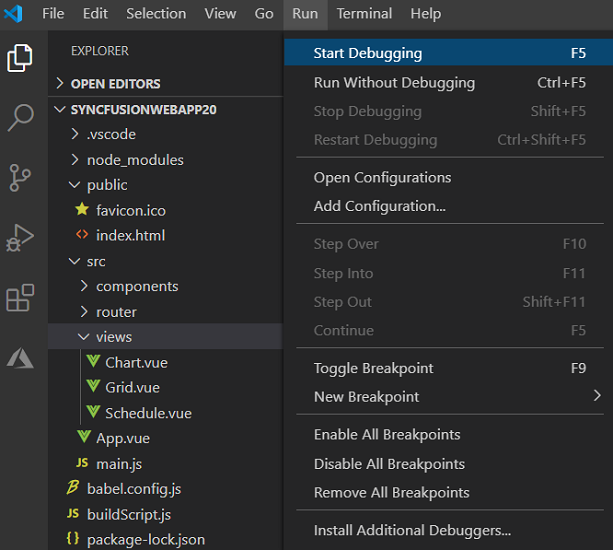
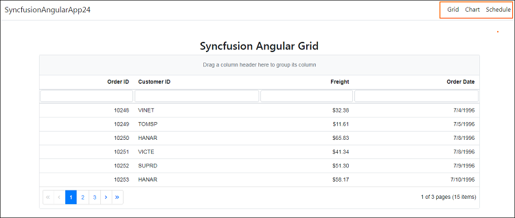

# Create project in Angular Visual studio code integration component

## Create project

Syncfusion provides **project templates** for **Visual Studio Code** to create Syncfusion Web applications. The Syncfusion Web Project template creates applications with the selected Framework (React, Angular, and Vue), required Syncfusion NPM packages, component render code for the Grid, Chart, and Scheduler components, and a style to make development with Syncfusion components easier.

   > The Syncfusion Visual Studio Code project template provides support for Web project templates from v18.3.0.47.

The steps below help you to create **Syncfusion Web Applications** through the **Visual Studio Code:**

1. In Visual Studio Code, open the command palette by pressing Ctrl+Shift+P. The Visual Studio Code palette opens, search the word Syncfusion, so you can get the templates provided.

    

2. Select **Syncfusion Web Template Studio: Launch** and then press enter, Template Studio wizard for configuring the Syncfusion Web app will appear. Provide the require Project Name and Path to create the new Syncfusion Web application along with any one of the Framework (React, Angular, and Vue).

    

3. Click either **Next** or **Framework** tab, the Framework types will be appearing and choose any one of the Framework:
   * React
   * Angular
   * Vue

      

    If you choose the Vue framework, the **Select Vue Version** option will appear in the **Project Details** section. You can create the Vue application using either the Vue 3 or Vue 2 versions.

    

4. Click either **Next** or the **Configuration** tab, and the Configuration section will be loaded. Choose the preferred theme and then click **Create**. The project will be created.

    

5. The created Syncfusion Web App is configured with the Syncfusion NPM packages, styles, and the component render code for the Syncfusion component added.

    

    

    

## Run the application

1. Click on **F5** or navigate to **Run>Start debugging**

    

2. After compilation process completed, open the local host link in browser to see the output.

    